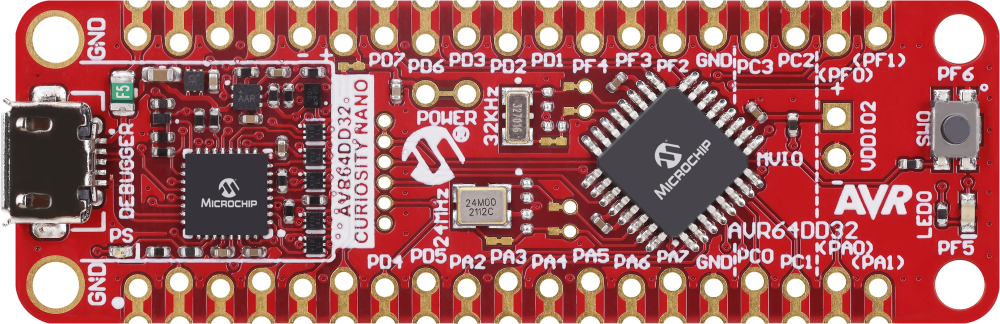
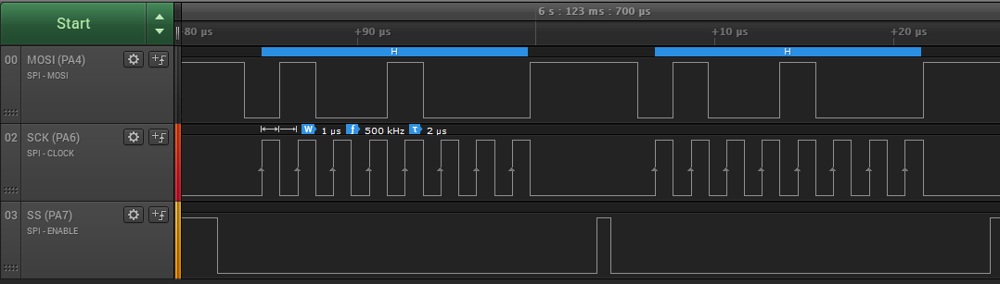
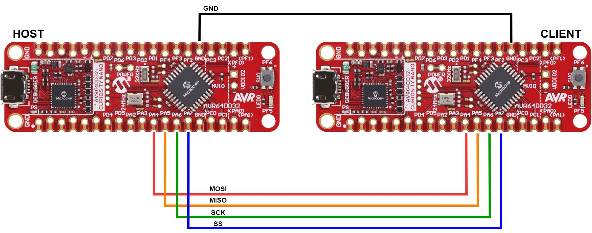
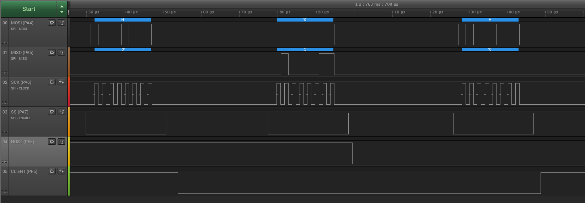

# Serial Peripheral Interface (SPI) Initialized in Two Different Modes using the AVR64DD32 Microcontroller with MCC Melody

 The repository contains two MPLAB® X projects:

1.  [Sending Data as a Host](#1-sending-data-as-a-host) – Configuring the device in the SPI Host mode to control a Client.
2.  [Host - Client Communication](#2-host---client-communication) – This folder contains two projects: one used to program the device as a Host and one used to program another device as a Client.

## Related Documentation

More details and code examples on the AVR64DD32 can be found at the following links:

- [AVR64DD32 Product Page](https://www.microchip.com/wwwproducts/en/AVR64DD32)
- [AVR64DD32 Code Examples on GitHub](https://github.com/microchip-pic-avr-examples?q=AVR64DD32)
- [AVR64DD32 Project Examples in START](https://start.atmel.com/#examples/AVR64DD32CuriosityNano)

## Software Used

- [MPLAB® X IDE](http://www.microchip.com/mplab/mplab-x-ide) v6.00 or newer
- [MPLAB® XC8](http://www.microchip.com/mplab/compilers) v2.36 or newer
- [AVR-Dx Series Device Pack](https://packs.download.microchip.com/) v2.1.152 or newer
- [MPLAB® Code Configurator Melody](https://www.microchip.com/en-us/tools-resources/configure/mplab-code-configurator/melody) v2.1.13 or newer
- AVR Devices Library v4.4.0 or newer
- Content Manager v2.3.7 or newer

## Hardware Used

- The AVR64DD32 Curiosity Nano Development Board is used as a test platform.
   
- Saleae Logic Analyzer 8

## Operation

To program the Curiosity Nano board with this MPLAB® X project, follow the steps provided in the [How to Program the Curiosity Nano Board](#how-to-program-the-curiosity-nano-board) chapter.  

## 1. Sending Data as a Host

This example shows how to configure the device in SPI Host mode, and send data to the Client (one byte with the ASCII `H` code).

### 1.1 Setup

The following configurations must be made for this project:

- System clock is configured at 4 MHz
- SPI
  - SPI clock configured at 500 kHz
  - SPI in Host mode
  - Data mode is 0
  - MSB transmitted first
  - Dedicated SPI pins:
    - PA4 (MOSI)
    - PA5 (MISO)
    - PA6 (SCK)

- GPIO
  - PA7 (SS) pin configured as output

|    Pin     | Configuration  |
| :--------: | :------------: |
| PA4 (MOSI) | Digital output |
| PA5 (MISO) | Digital input  |
| PA6 (SCK)  | Digital output |
| PA7 (SS)   | Digital output |

### 1.2 Demo

The MOSI (PA4), SCK (PA6), and SS (PA7) signals captured by a logic analyzer are shown in the image below, whereas the MISO is not shown. When the Host asserts the SS line (low), the Host device generates the SCK signal and sends the ASCII `H` code through the MOSI line. 
 

### 1.3 Summary

This example shows how to configure the device in SPI Host mode, and send data to a Client.  
[Back to top](#serial-peripheral-interface-spi-initialized-in-two-different-modes-using-the-avr64dd32-microcontroller-with-mcc-melody)  

## 2. Host - Client Communication

This example shows how to setup and initialize the SPI Host mode and SPI Client mode devices. The device used as a Host sends the ASCII `H` code through the MOSI line. The Client receives a value, if it is correct, it sends the value `C` back to the Host. If the value is not `H`, the Host receives the value `0x00` from the Client.

The diagram below shows how to connect the Host board with the Client board:

  

### 2.1 Setup – Host Board

The following configurations must be made for this project:

- System clock is configured at 4 MHz
- SPI0
  - SPI clock configured at 500 kHz
  - SPI in Host mode
  - Data mode is 0
  - MSB transmitted first
  - Dedicated SPI pins:
    - PA4 (MOSI)
    - PA5 (MISO)
    - PA6 (SCK)

- GPIO
  - PA7 (SS) pin configured as output

|    Pin     | Configuration – Host |
| :--------: | :------------------: |
| PA4 (MOSI) |    Digital output    |
| PA5 (MISO) |    Digital input     |
| PA6 (SCK)  |    Digital output    |
| PA7 (SS)   |    Digital output    |

### 2.2 Setup – Client Board

The following configurations must be made for this project:

- System clock is configured at 4 MHz
- SPI0
  - SPI in Client mode
  - Data mode 0
  - MSB transmitted first
  - Dedicated SPI pins:
    - PA4 (MOSI)
    - PA5 (MISO)
    - PA6 (SCK)
    - PA7 (SS)

- GPIO
  - Internal pull-up resistor enabled for PA7 (SS)

|    Pin     | Configuration – Client |
| :--------: | :--------------------: |
| PA4 (MOSI) |     Digital input      |
| PA5 (MISO) |     Digital output     |
| PA6 (SCK)  |     Digital input      |
| PA7 (SS)   |     Digital input      |

### 2.3 Demo

To test the functionality, a SPI Host device is used to exchange data with a Client.
 The Host transmits the ASCII `H` code as a response to character `C` from the Client.
 The Client can also send character `C` as a response to character `H` from the Host.
 If the characters `H` and `C` are not received by the communication parties, a NULL character is transmitted.
  One AVR64DD32 Curiosity Nano board is used for the SPI Host, while the other is used for the SPI Client.
 For visibility, some delays have been inserted between transactions.
     

### 2.4 Summary

This example illustrated shows how to initialize two devices in order to verify the communication between those devices.  
[Back to top](#serial-peripheral-interface-spi-initialized-in-two-different-modes-using-the-avr64dd32-microcontroller-with-mcc-melody)  

#

## How to Program the Curiosity Nano Board

This chapter shows how to use the MPLAB® X IDE to program an AVR® device with an Example_Project.X. This can be applied for any other projects.

1.  Connect the board to the PC.

2.  Open the Example_Project.X project in MPLAB® X IDE.

3.  Set the Example_Project.X project as main project.
     Right click the project in the **Projects** tab and click **Set as Main Project**.
     

4.  Clean and build the Example_Project.X project.
     Right click the **Example_Project.X** project and select **Clean and Build**.
     

5.  Select **AVRxxxxx Curiosity Nano** in the Connected Hardware Tool section of the project settings.
     Right click the project and click **Properties**.
     Click the arrow under the Connected Hardware Tool.
     Select **AVRxxxxx Curiosity Nano** (click the **SN**), click **Apply** and then **OK**.
     

6.  Program the project to the board.
     Right click the project and then **Make and Program Device**.
     

 

- [Back to 1. Sending Data as a Host](#1-sending-data-as-a-host)
- [Back to 2. Host - Client Communication](#2-host---client-communication)
- [Back to top](#serial-peripheral-interface-spi-initialized-in-two-different-modes-using-the-avr64dd32-microcontroller-with-mcc-melody)
